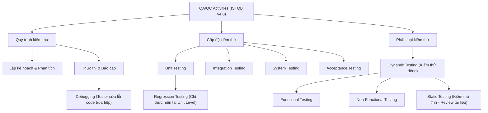
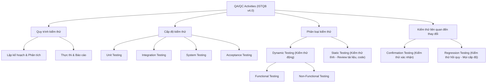

# Sơ đồ tư duy Vai trò QA/QC & Hoạt động Kiểm thử (ISTQB CTFL v4.0)

---

## 1. Sơ đồ tư duy do AI sinh

Dưới đây là sơ đồ tư duy dạng cây do AI sinh ra.

---

## 2. Phân tích 3 lỗi sai của AI

* **Lỗi sai 1 (Nhầm lẫn vai trò Debugging & Testing):**
  * *Mô tả lỗi:* AI xếp `Debugging (Tester sửa lỗi code trực tiếp)` là một hoạt động kiểm thử của Tester trong nhánh `Quy trình kiểm thử -> Thực thi & Báo cáo`.
  * *Phân tích đúng:* Theo giáo trình ISTQB, kiểm thử (Testing) và gỡ lỗi (Debugging) là hai hoạt động hoàn toàn khác nhau. Tester thực hiện kiểm thử để phát hiện lỗi (failures), trong khi Developer mới là người thực hiện debugging để tìm ra nguyên nhân gốc rễ (defects/bugs), phân tích và trực tiếp sửa đổi mã nguồn.
* **Lỗi sai 2 (Sai lệch phân cấp giữa Kiểm thử tĩnh và Kiểm thử động):**
  * *Mô tả lỗi:* AI xếp `Static Testing` (Kiểm thử tĩnh - Review tài liệu) làm nhánh con trực thuộc `Dynamic Testing` (Kiểm thử động).
  * *Phân tích đúng:* Kiểm thử tĩnh (Static Testing) và Kiểm thử động (Dynamic Testing) là hai phương pháp kiểm thử độc lập, bổ trợ cho nhau và nằm ở mức phân cấp ngang hàng (cùng trực thuộc nhánh cha là `Phân loại kiểm thử` hoặc `Phương pháp kiểm thử`). Kiểm thử tĩnh không chạy mã nguồn (chỉ review tài liệu, code), còn kiểm thử động bắt buộc phải thực thi mã nguồn.
* **Lỗi sai 3 (Giới hạn phạm vi của Kiểm thử hồi quy):**
  * *Mô tả lỗi:* AI kết nối `Regression Testing` (Kiểm thử hồi quy) như một nhánh con chỉ thực hiện tại `Unit Level`.
  * *Phân tích đúng:* Kiểm thử hồi quy (Regression Testing) không bị giới hạn ở Unit Level mà có thể và cần phải thực hiện ở mọi cấp độ kiểm thử (Unit, Integration, System, Acceptance) bất cứ khi nào phần mềm có sự thay đổi (mã nguồn, cấu hình hoặc môi trường) để đảm bảo các chức năng cũ không bị ảnh hưởng.

---

## 3. Sơ đồ tư duy đã được sửa đổi chính xác

